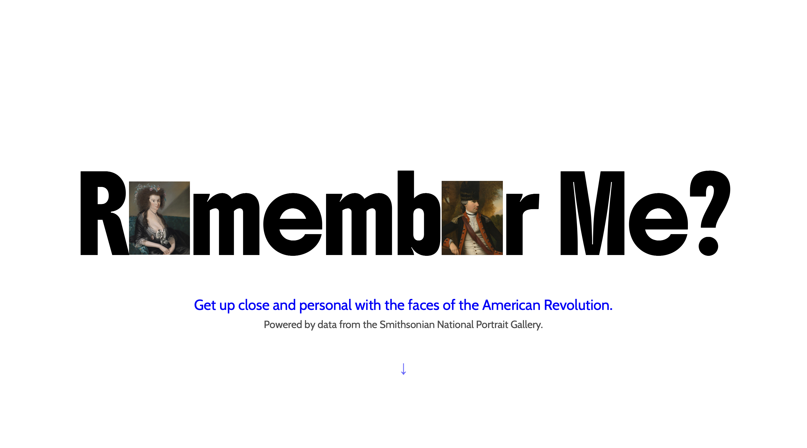
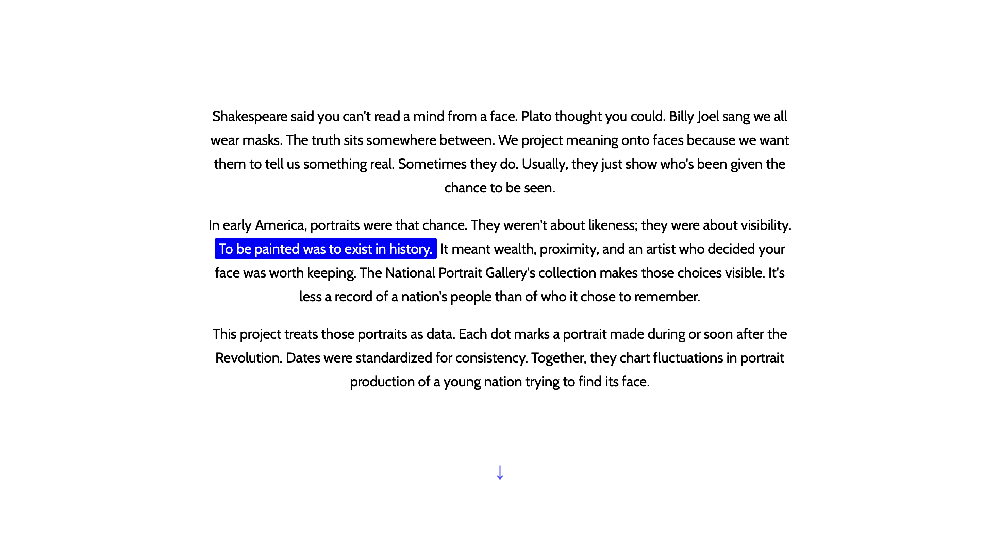
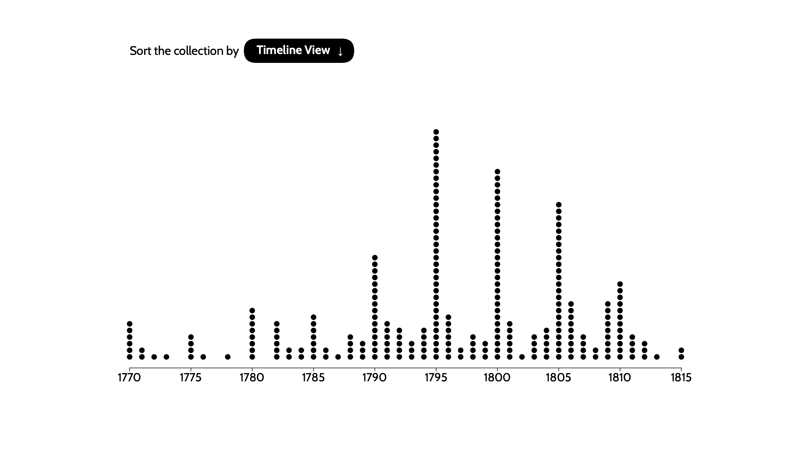
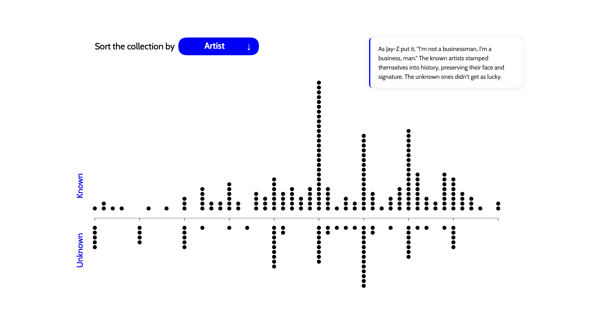
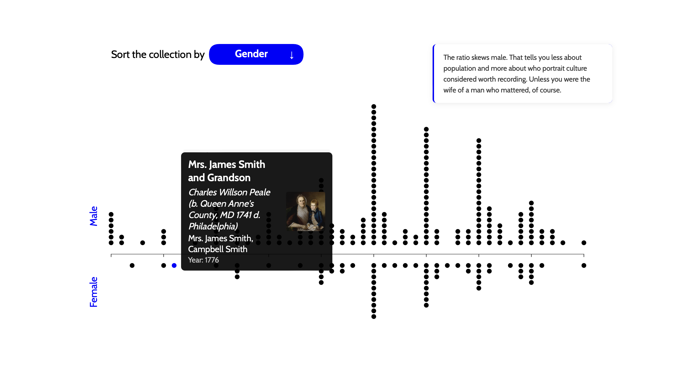
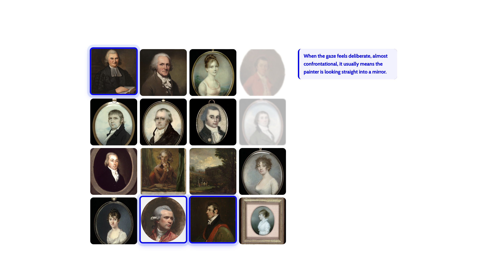
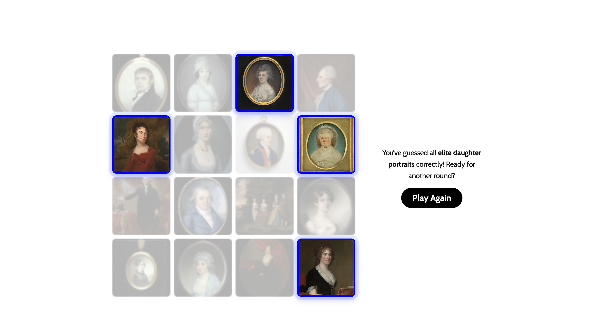
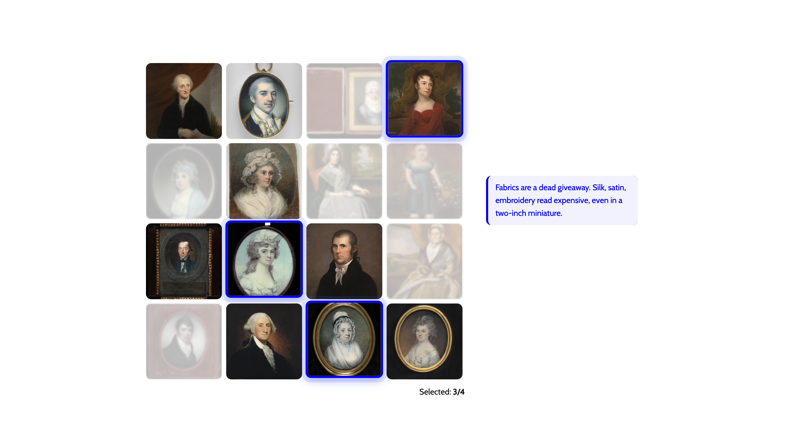
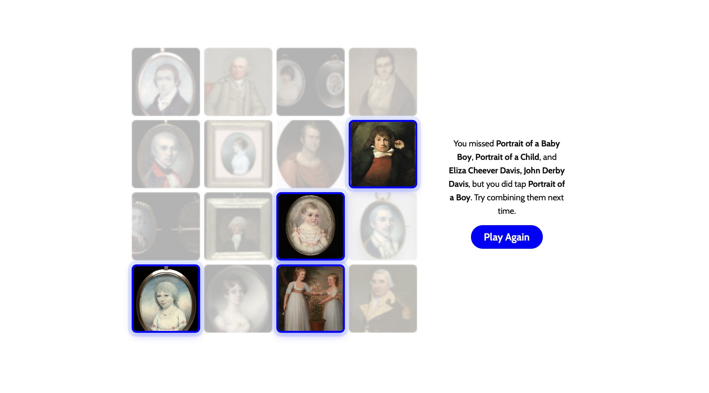
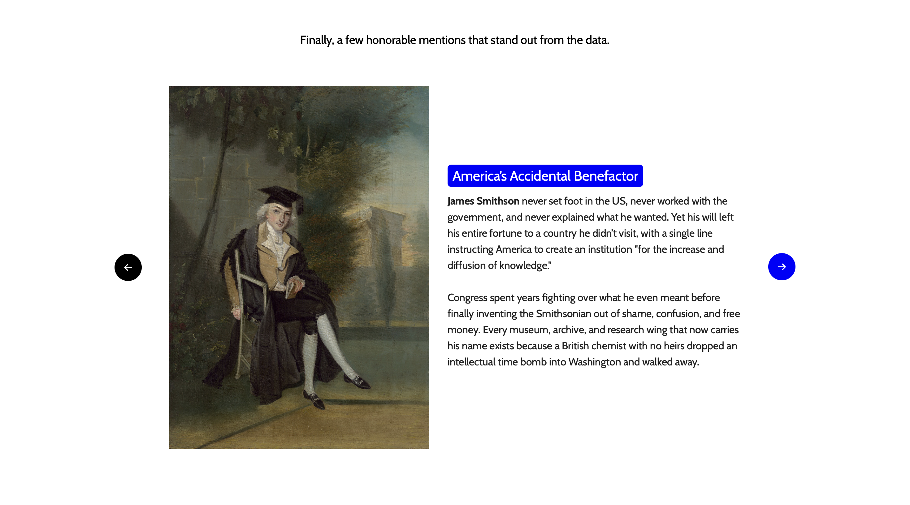

# Remember Me?

Remember Me? looks at portraits from the American Revolution and asks a basic question: who actually made it into the frame? I scraped data from the National Portrait Gallery and built a set of interactives (filters, connection game) that let you see the gaps for yourself. Men everywhere. Women barely visible. A handful of artists shaping what the “founders” even look like. It’s history told through portraits, but the absences say more than the faces. This isn’t about patriotism. It’s about who gets remembered, and who gets edited out.

## Sources

- [Smithsonian National Portrait Gallery](https://npg.si.edu/)
- [Revolution Crossroads (Hugging Face)](https://huggingface.co/RevolutionCrossroads)
- [Faces of a New Nation: American Portraits of the 18th and Early 19th Centuries (Carrie Rebora Barratt, 2003)](https://share.google/hYEkM5ILZM2jbAU9B)

## WIP Drafts

- [In-progress drafts and iterations](https://github.com/derinsavasan/major-studio-1/tree/main/wip-drafts)
- [Sketches PDF](https://github.com/derinsavasan/major-studio-1/blob/main/sketches/ms1-rev-cross.pdf)

## Screenshots

